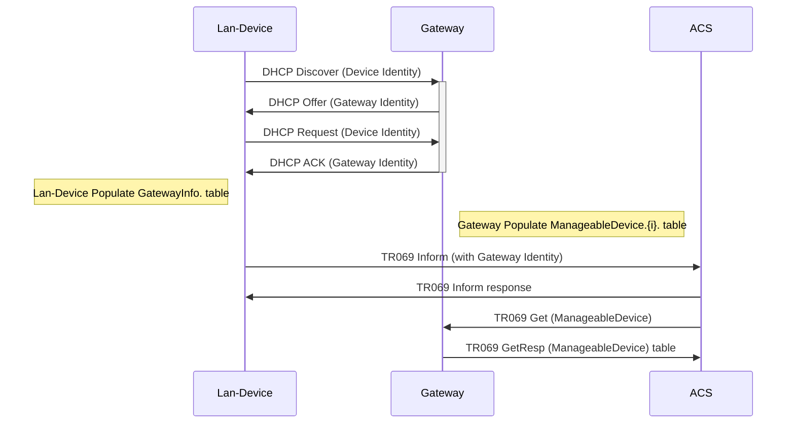

# CWMP Agent

`icwmpd` is a client implementation of [TR-069/CWMP](https://cwmp-data-models.broadband-forum.org/) protocol.

It is written in C programming language and depends on a number of libraries of OpenWrt for building and running.

## Good to Know

The `icwmpd` client is :
* Tested with several ACS such as **Axiros**, **AVSytem**, **GenieACS**, **OpenACS**, etc...
* Supports all required **TR069 RPCs**.
* Supports all DataModel of TR family such as **TR-181**, **TR-104**, **TR-143**, **TR-157**, etc...
* Supports all types of connection requests such as **HTTP**, **XMPP**, **STUN**.
* Supports integrated file transfer such as **HTTP**, **HTTPS**, **FTP**.

## Configuration File

The `icwmpd` UCI configuration is located in **'/etc/config/cwmp'**, and contains 3 sections: **'acs'**, **'cpe'** and **'lwn'**.

```bash
config acs 'acs'
	option userid 'iopsys'
	option dhcp_discovery 'enable'
	option compression 'Disabled'
	option retry_min_wait_interval '5'
	option retry_interval_multiplier '2000'

config cpe 'cpe'
	option default_wan_interface 'wan'
	option userid 'iopsys'
	option exec_download '0'
	
config lwn 'lwn'
	option enable '1'
	option hostname ''
	option port ''
```

> Note: `icwmpd` depends on usp.raw for all datamodel parameters, some `DeviceId` related parameters can be overwritten by writing them directly on `/etc/config/cwmp` file.

```bash
uci set cwmp.cpe.manufacturer="ABC"
uci set cwmp.cpe.manufacturer_oui="XXX"
uci set cwmp.cpe.product_class="TEST_CLASS"
uci set cwmp.cpe.serial_number="1234567890"
uci set cwmp.cpe.software_version="X.Y.Z"
uci set cwmp.cpe.model_name="MODELXXX"
uci set cwmp.cpe.description="This is a test device"
uci commit cwmp
```
> Complete UCI for `cwmp` configuration available in [link](./docs/api/uci.cwmp.md) or [raw schema](./schemas/uci/cwmp.json)

## RPCs Method supported

The following tables provides a summary of all methods, and indicates the conditions under which implementation of each RPC method defined in Annex A is `REQUIRED` or `OPTIONAL`.

### Methods for CPE responding

| Method name              | CPE requirement | Supported |
| ------------------------ | --------------- | --------- |
| `GetRPCMethods`          | `REQUIRED`      | `Yes`     |
| `SetParameterValues`     | `REQUIRED`      | `Yes`     |
| `GetParameterValues`     | `REQUIRED`      | `Yes`     |
| `GetParameterNames`      | `REQUIRED`      | `Yes`     |
| `SetParameterAttributes` | `REQUIRED`      | `Yes`     |
| `GetParameterAttributes` | `REQUIRED`      | `Yes`     |
| `AddObject`              | `REQUIRED`      | `Yes`     |
| `DeleteObject`           | `REQUIRED`      | `Yes`     |
| `Reboot`                 | `REQUIRED`      | `Yes`     |
| `Download`               | `REQUIRED`      | `Yes`     |
| `ScheduleDownload`       | OPTIONAL        | `Yes`     |
| `Upload`                 | OPTIONAL        | `Yes`     |
| `FactoryReset`           | OPTIONAL        | `Yes`     |
| `GetQueuedTransfers`     | OPTIONAL        | No        |
| `GetAllQueuedTransfers`  | OPTIONAL        | No        |
| `CancelTransfer`         | OPTIONAL        | `Yes`     |
| `ScheduleInform`         | OPTIONAL        | `Yes`     |
| `ChangeDUState`          | OPTIONAL        | `Yes`     |
| `SetVouchers`            | OPTIONAL        | No        |
| `GetOptions`             | OPTIONAL        | No        |


### Methods for CPE calling

| Method name                       | CPE requirement | Supported |
| --------------------------------- | --------------- | --------- |
| `GetRPCMethods`                   | OPTIONAL        | `Yes`     |
| `Inform`                          | `REQUIRED`      | `Yes`     |
| `TransferComplete`                | `REQUIRED`      | `Yes`     |
| `AutonomousTransferComplete`      | OPTIONAL        | `Yes`     |
| `DUStateChangeComplete`           | OPTIONAL        | `Yes`     |
| `AutonomousDUStateChangeComplete` | OPTIONAL        | `Yes`     |
| `RequestDownload`                 | OPTIONAL        | No        |
| `Kicked`                          | OPTIONAL        | No        |


## Concepts and Workflow

In OpenWRT integration, `icwmpd` depends on `procd` based init script `/etc/init.d/icwmpd` to start it in boot-up. Once started, it reads the initial configuration from UCI and if configured connects to the ACS.

Provisioning of the ACS URL can be done in `icwmpd` with a firmware default uci value, or it can be done dynamically using DHCP Option 43 on the configured default_wan_interface.

ACS Session workflow could be checked with sniffer packets tool such as Wireshark or `tcpdump`.
In addition to that, `icwmpd` give provision to configure a log file in uci.
A snapshot of log description is listed below for demonstration(Content of the log can vary based on configuration):

```bash
24-12-2019, 10:21:18 [INFO]    STARTING ICWMP with PID :7762
24-12-2019, 10:21:18 [INFO]    Periodic event is enabled. Interval period = 180000s
24-12-2019, 10:21:18 [INFO]    Periodic time is Unknown
24-12-2019, 10:21:18 [INFO]    Connection Request server initiated with the port: 7547
24-12-2019, 10:21:18 [INFO]    Start session
24-12-2019, 10:21:18 [INFO]    ACS url: http://genieacs:7547
24-12-2019, 10:21:18 [INFO]    Preparing the Inform RPC message to send to the ACS
24-12-2019, 10:21:18 [INFO]    Send the Inform RPC message to the ACS
24-12-2019, 10:21:19 [INFO]    Get the InformResponse message from the ACS
24-12-2019, 10:21:19 [INFO]    Send empty message to the ACS
24-12-2019, 10:21:19 [INFO]    Receive HTTP 204 No Content
24-12-2019, 10:21:19 [INFO]    End session
24-12-2019, 10:21:19 [INFO]    Waiting the next session
```

Further, it provides different log level that can be configured in uci config `cwmp.cpe.log_severity` to get more verbose log to no logs.

## uBus

`icwmpd` provides some RPCs support over ubus and some debug utilities those can be accessed using `tr069` ubus object. So, it must be launched on startup after `ubusd`.

> Note: For more info on the `tr069` ubus schema see [link](./docs/api/tr069.md) or [raw schema](./schemas/ubus/tr069.json)

### tr069 ubus examples
Please note, the output shown in below examples are just for demonstration purpose, the actual output shall vary as per the cwmp configuration and state.
The schema for UBUS is available at [link](./docs/api/tr069.md) or [raw schema](./schemas/ubus/tr069.json)

```bash
root@iopsys:~# ubus -v list tr069
'tr069' @aadff65c
        "command":{"command":"String"}
        "status":{}
        "inform":{"GetRPCMethods":"Boolean","event":"String"}
root@iopsys:~#
```

Each object registered with the `'tr069'` namespace has a specific functionality.

- To get the status of cwmp client, use the `status` ubus method:

```bash
root@iopsys:~# ubus call tr069 status
{
        "cwmp": {
                "status": "up",
                "start_time": "2021-07-29T09:29:02+02:00",
                "acs_url": "http://genieacs:7547"
        },
        "last_session": {
                "status": "success",
                "start_time": "2021-07-29T09:29:59+02:00",
                "end_time": "2021-07-29T09:30:00+02:00"
        },
        "next_session": {
                "status": "waiting",
                "start_time": "2021-07-29T09:59:59+02:00",
                "end_time": "N/A"
        },
        "statistics": {
                "success_sessions": 2,
                "failure_sessions": 0,
                "total_sessions": 2
        }
}
root@iopsys:~#
```

- To trigger a new session to ACS with the event `'6 CONNECTION REQUEST'` or `'8 DIAGNOSTICS COMPLETE'`, etc.., use the `inform` ubus method with the appropriate `event` argument:

```bash
root@iopsys:~# ubus call tr069 inform '{"event":"6 CONNECTION REQUEST"}'
{
	"status": 1,
	"info": "Session started"
}
root@iopsys:~#
root@iopsys:~# ubus call tr069 inform '{"event":"8 DIAGNOSTICS COMPLETE"}'
{
	"status": 1,
	"info": "Session started"
}
root@iopsys:~#
root@iopsys:~# ubus call tr069 inform '{"GetRPCMethods":"1"}'
{
	"status": 1,
	"info": "Session started"
}
root@iopsys:~#
```

- To reload the icwmpd config, use the `command` ubus method with `reload` argument:

```bash
root@iopsys:~# ubus call tr069 command '{"command":"reload"}'
{
	"status": 1,
	"info": "icwmpd config reloaded"
}
root@iopsys:~#
```
## icwmpd command line

`icwmpd` command line options are described with `--help` option as below:

```bash
root@iopsys:~# icwmpd --help
Usage: icwmpd [OPTIONS]
 -b, --boot-event                                    (CWMP daemon) Start CWMP with BOOT event
 -g, --get-rpc-methods                               (CWMP daemon) Start CWMP with GetRPCMethods request to ACS
 -c, --cli                                           CWMP CLI
 -h, --help                                          Display this help text
 -v, --version                                       Display the version
```

## icwmpd CLI

The icwmpd CLI is a debug utility and can be invoked using -c (--cli) command line option.

Different options of this CLI are described with help command as below:

```bash
root@iopsys:~# icwmpd -c help
Valid commands:
        help                                    => show this help
        get [path-expr]                         => get parameter values
        get_names [path-expr] [next-level]      => get parameter names
        set [path-expr] [value]                 => set parameter value
        add [object]                            => add object
        del [object]                            => delete object
        get_notif [path-expr]                   => get parameter notifications
```
> Note: icwmpd CLI is a debug utility and hence it is advised to use for debug and development purpose only.
> icwmpd CLI utility is independent of icwmpd daemon.

icwmp CLI command success result is displayed in the terminal as following:

```bash
root@iopsys:~# icwmpd -c get Device.DeviceInfo.UpTime
Device.DeviceInfo.UpTime => 91472
root@iopsys:~# icwmpd -c set Device.WiFi.SSID.1.SSID wifi1_ssid
Set value is successfully done
Device.WiFi.SSID.1.SSID => wifi1_ssid
```
In the case of fault the result is displayed as following:

```bash
root@iopsys:~# icwmpd -c get Device.DeviceInfo.UpTme
Fault 9005: Invalid parameter name
root@iopsys:~# icwmpd -c set
Fault 9003: Invalid arguments
root@iopsys:~# icwmpd -c set Device.WiFi.SSID.1.SSID
Fault 9003: Invalid arguments
```
## SPV Response and restart services
In case `icwmpd` receives from the ACS SetParameterValues Request, it will use the uspd setm_values ubus method for all requested parameters.

Basing on setm_values response the icwmp will do the following:

- in case of fault icwmp aborts the set of all parameters and then sends Response to the ACS with FAULT 9003 including all parameters faults as defined in TR069 standard.
- in case of success icwmp commits the set of all parameters, without applying them so without restarting services, and then sends a success Response to the ACS including the status code 1.

> - All restart services are done in the CWMP end session in order to prevent any session interruption.
> - icwmp always returns 1 as status value in case of success SPV because all restart services are done in the end session.

## icwmpd forced inform parameters
As per the cwmp inform requirements, cwmp client has list of parameters defined internally. The list contains below parameters:

| Parameter name                                 |
| ---------------------------------------------- |
| Device.RootDataModelVersion                    |
| Device.DeviceInfo.HardwareVersion              |
| Device.DeviceInfo.SoftwareVersion              |
| Device.DeviceInfo.ProvisioningCode             |
| Device.ManagementServer.ParameterKey           |
| Device.ManagementServer.ConnectionRequestURL   |
| Device.ManagementServer.AliasBasedAddressing   |


In addition to the above defined forced inform parameters as specified in datamodel standard, TR-181 datamodel defines the multi instance object Device.ManagementServer.InformParameter.{i}. 
So new inform parameter can be added through the ACS by the call of the RPC method AddObject for the object Device.ManagementServer.InformParameter.{i}. and then set its parameters values.
icwmpd defines those new inform parameters in uci sections under the package /var/state/cwmp as below:

```bash
root@iopsys-44d43771aff0:~# cat /var/state/cwmp 

config inform_parameter
	option enable '1'
	option parameter_name "Device.DeviceInfo.UpTime"
	option events_list '1 BOOT,6 CONNECTION REQUEST'

config inform_parameter
	option enable '0'
```

## Notification management
`icwmpd` support below notification types, which can be configured from an ACS on the datamodel parameters
 - 0 = Notification off
 - 1 = Passive notification
 - 2 = Active notification
 - 3 = Passive lightweight notification
 - 4 = Passive notification with passive lightweight notification
 - 5 = Active lightweight notification
 - 6 = Passive notification with active lightweight notification

Along with this it does provide some debug utilities to get the notification from the device root shell as well
```bash
root@iopsys:~# icwmpd -c get_notif Device.Users.User.1.Username
Device.Users.User.1.Username => passive
```

To fulfill the requirement of forced active notification parameters, `icwmpd` internally maintains a list of forced active parameters specified in TR181. The list contains below parameters:

| Parameter name                        | Notification  |
| ------------------------------------- |---------------|
| Device.DeviceInfo.SoftwareVersion     |	2	|
| Device.DeviceInfo.ProvisioningCode    |	2	|

So, Creation of any other type of notification on the above parameters results in a cwmp fault 9009.


Along with this `icwmpd` support configuration of notification parameters using a JSON file. Users can include this json file in there firmware to override the existing notification parameters, or add new notifications from the firmware itself.


Below is the schema/format of the JSON file:

```bash
root@iopsys:~# cat /etc/icwmpd/inform.json
{
  "custom_notification": [
    {
      "parameter": "Device.Users.",
      "notify_type": "2"
    },
    {
      "parameter": "Device.WiFi.SSID.1.SSID",
      "notify_type": "1"
    }
  ]
}
```

> Note: In the Above example, parameter has to be defined with a valid datamodel parameter name and notify_type needs to be the notification type (number as present in the above table). Both the parameters are required.


After defining the JSON file with all the required parameters, this information required to update cwmp uci as below:
```bash
root@iopsys:~# uci set cwmp.cpe.custom_notify_json=/etc/icwmpd/inform.json
root@iopsys:~# uci commit cwmp
root@iopsys:~# /etc/init.d/icwmpd restart
```

>- ACS can manage the attributes of parameter added by custom_notification as it does for the other parameters
>- After firmware upgrade, for the 1st bootup, the custom_notify_json has higher priority, latter on ACS configured attributes get priority.
>- Addition of custom notification parameters is one time activity after upgrade, once done It can only be managed through ACS.
>- Parameters with wildcard not supported currently. So parameter like Device.WiFi.SSID.*. will be skipped


## How to configure icwmp client for HTTPS connection to ACS

In order to keep the connection secure, most customers use HTTPS to connect to ACS.

In this case we need to have an ACS that supports HTTPS, And for that we use GenieACS as an example because it's an open source and supports HTTPS.

Find below the required steps to configure GenieACS server and icwmp client to support HTTPS

### Generating the private key and certificate

1. Generate a private key for the CA:

```bash
root@75f824228409:/opt/genieacs# openssl genrsa 2048 > ca-key.pem
Generating RSA private key, 2048 bit long modulus (2 primes)
...................................................................................+++++
...........................+++++
e is 65537 (0x010001)
```

2. Generate the X509 certificate for the CA:

```bash
root@75f824228409:/opt/genieacs# openssl req -new -x509 -nodes -days 365000 -key ca-key.pem -out ca-cert.pem
You are about to be asked to enter information that will be incorporated
into your certificate request.
What you are about to enter is what is called a Distinguished Name or a DN.
There are quite a few fields but you can leave some blank
For some fields there will be a default value,
If you enter '.', the field will be left blank.
-----
Country Name (2 letter code) [AU]:SE
State or Province Name (full name) [Some-State]:Stockholm
Locality Name (eg, city) []:Stockholm
Organization Name (eg, company) [Internet Widgits Pty Ltd]:IOPSYS
Organizational Unit Name (eg, section) []:IOPSYS
Common Name (e.g. server FQDN or YOUR name) []:genieacs
Email Address []:dev@iopsys.eu
root@75f824228409:/opt/genieacs# 
```

> Note: When generating the certificate, you must fill the Common Name filed with the correct URL server (for example here 'genieacs') otherwise you will get an error later when trying to connect to the ACS.

### Installing and Configuring GenieACS environment variables

1. Install GenieACS

You can follow the steps described in this [link](http://docs.genieacs.com/en/latest/installation-guide.html) in order to install GenieACS.

2. Configure GenieACS environment variables to support HTTPS

GenieACS offers a list of environment variables to configure the different features, you can see all the information in detail in this [link](http://docs.genieacs.com/en/latest/environment-variables.html).

In fact, the most important to us are these two variables below to configure the SSL functionality.

```bash
GENIEACS_CWMP_SSL_CERT=/path/to/certificate/file/ca-cert.pem
GENIEACS_CWMP_SSL_KEY=/path/to/certificate/key/file/ca-key.pem
```

### Checking the generated Certificate

You can use `openssl` command to check if there is any error in generated certificate.

```bash
openssl s_client -connect genieacs:7547 -CAfile ca-cert.pem
```

### Configuring DUT to support HTTPS

1. Copy the generated certificate under the needed path (default path is '/etc/ssl/certs/')

```bash
scp /path/of/certificate/ca-cert.pem root@192.168.1.1:/etc/ssl/certs
```

2. Set 'ssl_capath' option in cwmp config with certificate directory path (default path is '/etc/ssl/certs/')

```bash
uci set cwmp.acs.url='https://genieacs:7547'
uci set cwmp.acs.ssl_capath="/etc/ssl/certs"
ubus call uci commit '{"config":"cwmp"}'
```

Now, all required configuration are ready and you can start a cwmp connection using HTTPS.

## Manageable devices and Gateway Information (TR069 - Annex F)
> The CPE WAN Management Protocol can be used to remotely manage CPE Devices that are connected via a LAN through a Gateway. When an ACS manages both a Device and the Gateway through which the Device is connected, it can be useful for the ACS to be able to determine the identity of that particular Gateway.
> -- <cite> TR-69 Annex F.</cite>

Below is the sequence diagram for the Device-Gateway association with DHCP Discover.


### Gateway Procedures
A Gateway here in this context means, an Annex-F capable CPE running icwmpd which provide LAN/NAT connectivity.

The Gateway Identity tuple (OUI, ProductClass, SerialNumber) is present in 'db' (Same source used for Device.DeviceInfo. object).

The `/etc/init.d/icwmp` script reads the default lan interface from UCI option `cwmp.cpe.default_lan_interface` and configures the gateway identity in `dhcp` UCI for the corresponding LAN interface section to publish gateway information to its LAN clients.
> Note: If UCI option `cwmp.cpe.default_lan_interface` is not defined then gateway identity would not be published in LAN network.

#### Identification of Manageable Device in LAN network
Gateway device relies on DHCP options (/tmp/dhcp.client.options) file for getting the Manageable Device identities, which is exposed in the TR181 datamodel using (libbbf) API's.

The Device.ManagementServer.ManageableDevice.{i}. object table is populated for the active devices available in `Device.Hosts.` table and their device identity is collected from `/tmp/dhcp.client.options` file.

### Lan-Device procedures
A Lan-Device here in this context means, an Annex-F capable CPE running icwmpd which is connected via a LAN through a Gateway.

The Lan-Device Identity tuple (OUI, ProductClass, SerialNumber) is present in 'db' (Same source used for Device.DeviceInfo. object).

The `/etc/init.d/icwmp` script reads the default wan interface from UCI option `cwmp.cpe.default_wan_interface` and configures the device identity in `network` UCI to publish its own identity to upstream network (DHCP server) using DHCP option 125 for the corresponding wan interface.
> Note: If UCI option `cwmp.cpe.default_wan_interface` is not defined then it assumes the default interface as `wan`.

#### Identification of Gateway Device in WAN network
If lan-device(CPE) receives DHCP option 125 in DHCP offer from upstream network it exposes the same in its UBUS method (e.g. ifstatus wan).

```bash
root@iopsys-44d43771b000:~# ifstatus wan
{
	...
	...
	"data": {
		"opt125": "XXXXXXXXXXXXXXXXXXX"
	}
}
```
ICWMPD package adds a DHCP client hook script (`/etc/udhcpc.user.d/udhcpc_icwmp.user`), which parses DHCP option 125 to extract gateway identity based on Enterprise ID `3561`.
This script then writes the gateway identity in `/var/state/cwmp` if CWMP is enabled in the device.

Datamodel (libbbf) API's reads the gateway information from `/var/state/cwmp` to populate Device.GatewayInfo. object. If gateway information is not available in `/var/state/cwmp` then it reads the 'db' (Same source used for Device.DeviceInfo. object) and maps that data to populate Device.GatewayInfo. object.

## Dependencies

To successfully build icwmp, the following libraries are needed:

| Dependency  | Link                                        | License        |
| ----------- | ------------------------------------------- | -------------- |
| libuci      | https://git.openwrt.org/project/uci.git     | LGPL 2.1       |
| libubox     | https://git.openwrt.org/project/libubox.git | BSD            |
| libubus     | https://git.openwrt.org/project/ubus.git    | LGPL 2.1       |
| libjson-c   | https://s3.amazonaws.com/json-c_releases    | MIT            |
| libwolfssl  | https://github.com/wolfSSL/wolfssl          | GPL-2.0        |
| libcurl     | https://dl.uxnr.de/mirror/curl              | MIT            |
| mxml        | https://github.com/michaelrsweet/mxml       | GPL-2.0       |

Runtime dependencies:

| Dependency  | Link                                        | License        |
| ----------- | ------------------------------------------- | -------------- |
| ubus        | https://git.openwrt.org/project/ubus.git    | LGPL 2.1       |
| bbf         | https://dev.iopsys.eu/iopsys/bbf.git        | LGPLv2.1       |
| uspd        | https://dev.iopsys.eu/iopsys/uspd.git       | GPL v2.0       |

> icwmpd gets the datamodel from the DUT via ubus using uspd, and also it registers `tr069` ubus namespace to expose some debug and cwmp client rpc funtionalities, so it is required to start it after starting `ubusd` and `uspd`.
