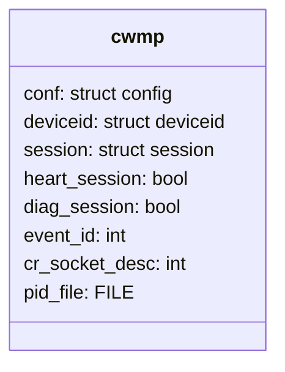
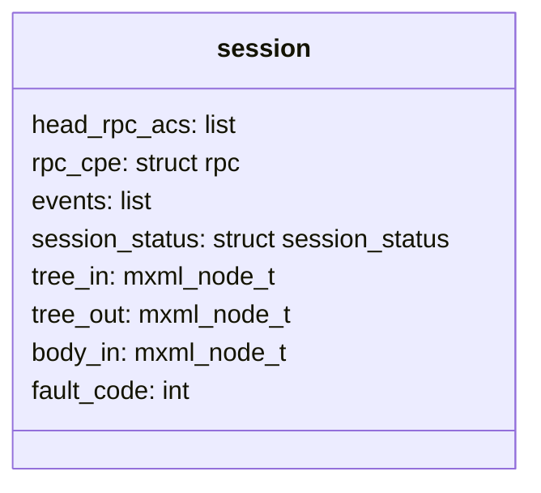
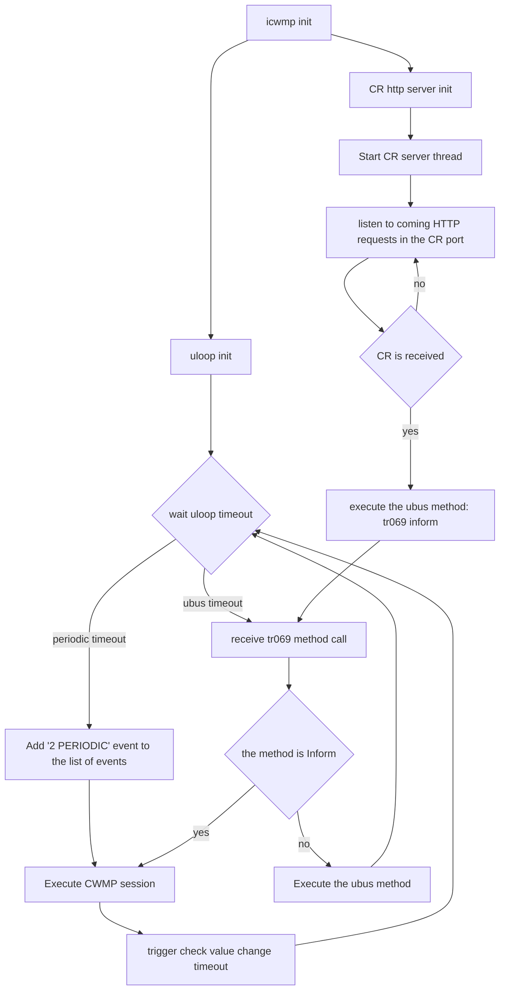
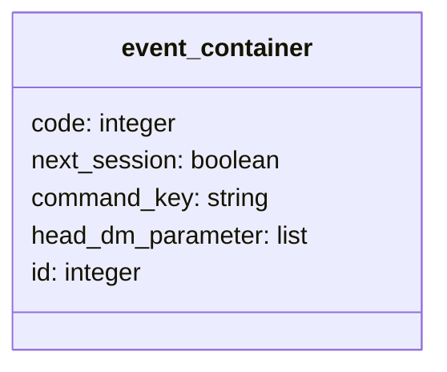

# Design of icwmpd (TR069 client)

`icwmpd` is a client side implementation of the CWMP protocol. It's in conformance with all the required features described in the TR-069 standard.
It supports TR-069 features like cwmp session management, events management, SOAP management, RPC methods management etc.

### Source file tree as per CWMP Stack

As described in TR-069 standard, the CWMP stack comprises several components that are unique to this protocol, and makes use of several standard protocols:

| Feature | Source file(s) | Description |
| ------- | -------------- | ----------- |
| Application | cwmp.c, session.c | cwmp client implementation based on libubox's uloop functionality |
| RPC Methods | rpc.c | Handling of both acs and cwmp rpc methods as defined in TR069 |
| SOAP | xml.c |A standard XML-based syntax used here to encode remote procedure calls along with SOAP handling |
|HTTP |http.c, digauth.c | Responsible to send SOAP messages over HTTP using libcurl library. |
| SSL/TLS | ssl_utils.c | Provides SSL/TLS functionality over HTTP with OpenSSL |

| Common source files |
| ----- |
| backup_session.c |
| cwmp_uci.c |
| ubus_utils.c |
| subprocess.c |
| common.c |
| config.c |
| datamodel_interface.c |
| diagnostic.c |
| download.c |
| upload.c |
| notifications.c |

## Main structure of icwmp app

`icwmpd` main context stored in cwmp global structure, the following schema presents this structure with the most important attributes:

| Item | Type | Description | Comment |
| ---- | ---- | ----------- | ------- |
| conf | config structure | config structure is responsible for defining the UCI configuration of the application. It is loaded in the start of icwmp. | Multiple UCI options are defined in this structure such as configurations related to the CPE like CR credentials, CR port, provisioning code and configurations related to the ACS connection like ACS access username/password, periodic_inform_enable, periodic_inform_interval, and so on. |
| heart_session | boolean attribute | This attribute is used to check if the running session is a Heartbeat session. ||
| diag_session | boolean attribute | This  attribute is used to check if the running session contains the event '8 DIAGNOSTICS COMPLETE' ||
| event_id | integer attribute | is used by the app to store the number of events in the running session. ||
| cr_socket_des | integer attribute | This attribute contains the id of the socket used by the CR. ||
| pide_file | File type attribute | This file used by the app in order to garantuate a single app instance running. ||
| deviceid | deviceid structure | This struct contains the device information important attributes values. like ManufacturerOUI, Manufacturer, SerialNumber, ProductClass, SoftwareVersion. | |
| session | session structure | This structure contains attributes related to the running session. ||

Session Attributes:

| Item | Type | Description | Comment |
| ---- | ---- | ----------- | ------- |
| rpc_cpe | struct rpc | It contains RPC method that is just requested by the ACS to be executed in the CPE. |  |
| head_rpc_acs | struct list_head | It contains RPC methods list that the CPE requests to be executed in the ACS side in the actual session. |  |
| events | struct list_head | It contains list of events that the CPE notifies the ACS in the Inform message of the actual session. |  |
| session_status | struct session_status | It contains information about the running session like start time, end time, if it's successful or failed session, hearbeat session validation, and so on. |  |

## icwmp application

The following diagram shows how icwmp application manage CWMP sessions with uloop:

As described in the diagram, after initiating the icwmp application (config init, backup init, ...), the application trigger:

1. Some functionalities controlled/managed by using uloop timers, below are the list of timers:

- ubus methods timeout
- autonomous policy timeouts
- session timeout
- heartbeat timeout
- periodic session timeout

these timers gets initialized when the application starts then wait for the uloop timeout events.

2. A thread is created at the same time.
   It permits a permenant listening of the port , in the purpose to receive connection requests. In case a CR is received successfully "tr069 inform" ubus call is triggered from this thread in the purpose to trigger a new session with '6 CONNECTION REQUEST' event.

## icwmp tr-069 session

[CWMP session in icwmp client](./session.md)

## Inform ACS method

The Inform ACS request is sent by the CPE to the ACS in the start of the CWMP session, in order to inform him about information like the device id, events, software version, the CR url ...

In icwmp the corresponding function responsible to create the Inform message is cwmp_rpc_acs_prepare_message_inform. It starts by getting the device ID attributes and the list of events that needs to be included in the inform message and then parameters that are amended in the ParameterList including default Inform Parameter and other parameters like parameters related to the Value Change.

## Events manipulation

As described in TR069 standard, events in CWMP protocol must be sent by the CPE in an Inform request in order to notify the ACS when something of interest has happened.
CWMP events are stored in the **events** list attribute of the session structure attribute. Each element of this list is an instance of the structure event_container that is the following:

When creating an inform message, the events are loaded from the **events** list.

| Inform Events  |  Description of the event |
| -------------- | ------------------------- |
| 0 BOOTSTRAP    | Included when client connects with the ACS for the very first time |
| 1 BOOT         | When cwmp client reloads or reboots |

Event associated with reboot/upgrades

| Event     | Description of the event |
| --------  | ------------------------ |
| M Reboot   | Reboot triggered from ACS |
| M Download | Reboot caused by firmware upgrade |
| M ScheduleDownload | Reboot caused by a scheduled firmware upgrade |
| 7 TRANSFER COMPLETE |  |

Runtime events, while handling RPC calls below events gets added in the list:

| Event    | Description of the event |
| -------- | ------------------------ |
| 3 SHEDULED | for ScheduleInform method |
| 7 TRANSFER COMPLETE| in the call of Download, Upload |
| 8 DIAGNOSTIC COMPLETE | after completing diagnostic execution triggered by the ACS |
| 11 DU STATE CHANGE COMPLETE| after completing DU request execution triggered by the ACS |

Periodic events:

| Event    | Description of the event |
| -------- | ------------------------ |
| 2 PERIODIC | Periodic inform messages |
| 14 HEARTBEAT | Periodic heartbeat messages |

External Events:

| Event    | Description of the event |
| -------- | ------------------------ |
| 6 CONNECTION REQUEST| when receiving a connection request from the ACS in order to start a new session. |
| 4 VALUE CHANGE |check notifications part | |
| 10 AUTONOMOUS TRANSFER COMPLETE| |
| 12 AUTONOMOUS DU STATE CHANGE COMPLETE | |

## Notifications

[Notifications in icwmp client](./notifications.md)

## XML in icwmp

[XML mechanism in icwmp client](./xml.md)

## Backup Session management

The backup session feature in icwmp is used to store data that should be conserved even after reboot or system upgrade:

- events
- download
- transfer complete
- schedule download
- schedule inform
- upload
- change du state
- autonomous change du state
- du state change complete

This data is stored in xml format in the file  `/etc/icwmpd/icwmpd_backup_session.xml`.

The data is loaded by calling the function `cwmp_load_saved_session` at the start of the icwmp application.

The backup session feature uses XML functions (check XML part) to build/load XML nodes that should be stored in the backup session file.

For each kind of backup session data there are rows in `xml_nodes_data`. Their indexes are defined in the enumeration `xml_node_references`.

All backup session indexes are successive in the enumeration and starts with `BKP_`.

For each kind of backup session data, there are insert functions that call `build_xml_node_data` and load functions that calls `load_xml_node_data`.

## UCI and config mangement

- [UCI](./docs/api/uci/cwmp.md)
- [UBUS](./docs/api/uci/tr069.md)
