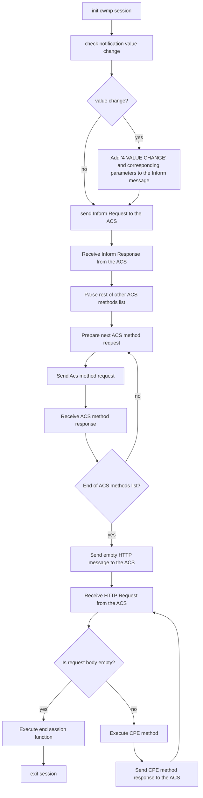
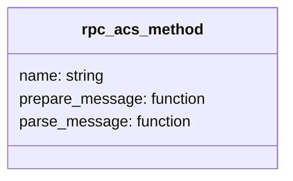
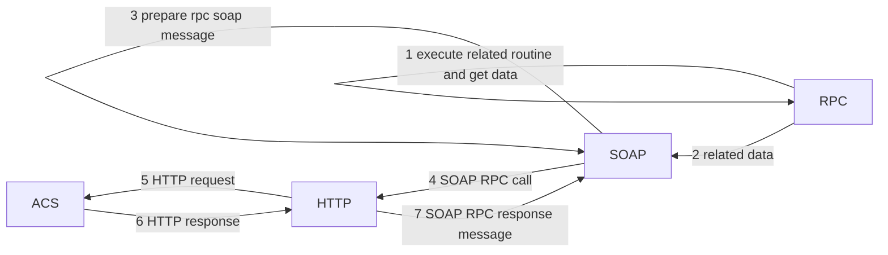
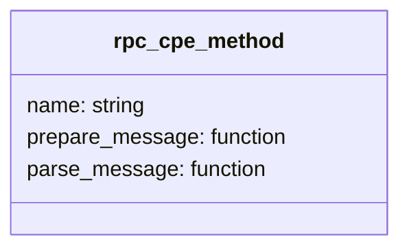
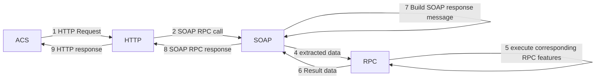

# CWMP session in icwmp client

In icwmp client, the CWMP session is executed under a uloop timeout handler that calls the C function responsible on the CWMP session execution: start_cwmp_session that has the following activity diagram:

 

The CWMP session starts by initiating. The session initialisation contains essentially:

- The uci initialisation
- RPC ACS methods list initialisation

After that it checks if values of active/passive parameters are changed. Then it parses the RPC ACS methods list and starts with Inform method by sending its corresponding SOAP message in a HTTP Request to the ACS and then receives its corresponding response. 
Then it completes following the other ACS methods in the list and make send/receive to the ACS. 

In the next step the session sends an empty message to the ACS, therefore it starts receiving the RPC CPE methods requests from the ACS until it receives an empty message from the ACS. After that, after completing the execution of CPE methods Requests it execute the end session tasks (run_session_end_func), that includes all tasks that are requested in the session and need to be complete execution in the end session, like reloading config, restart services, download and apply files ...
In the last step the session completes by exiting. The session exit contain essentially:

- uci exit
- memory clean
- rpc methods list clean

## RPC ACS methods

RPC ACS methods are called just after initiating the session. It starts by the call of Inform method then GetRPCMethods. after that it complete other methods in the head_rpc_acs list.

In icwmp RPC ACS methods are defined in the array rpc_acs_methods of the structure rpc_acs_method. 

- name: is a string attribute. It contains the name the RPC.
- prepare_message: it's a function attribute. This function is responsible to create the SOAP message that will be sent as the RPC method call to the ACS.
- parse_response: it's a function attribute. This function is responsible to to parse the SOAP message coming from the ACS

RPC ACS method is executed in a process respecting the tr-069 protocol layer as described in the following communication diagram:

The RPC ACS call starts by preparing needed data after executing some features in RPC layer. Features that are executed differs from ACS method to an other:

- **Inform**

    Data present in the Inform call message are gotten form runtime variables and lists like events and also by execting internal get value (ubus usp.raw call) of some parameters for DeviceId and ParameterList.

- **TransferComplete**

    Transfer complete data can be gotten from backup session (in case of reboot or sysupgrade) or internal variables

- **AutonomousTransferComplete and AutonomousDUStateChangeComplete**

    Corresponding data are gotten from when receiving the ubus event usp.event.

After getting needed data, the corresponding RPC ACS prepare_message prepare the SOAP message that will be after that integrating as a body of a HTTP Request message. Then using curl library the HTTP layer part sends the HTTP Request to the ACS..
In the next step after the CPE receive the HTTP response from the ACS, it extracts the SOAP message and then needed data from the SOAP message.

## RPC CPE methods

In icwmp RPC CPE methods are defined in the array rpc_cpe_methods of the structure rpc_cpe_method.

- name: is a string attribute. It contains the name the RPC.
- handler: the corresponding the handler function responsible to extract data from the SOAP message and then execute corresponding features

RPC CPE method is executed in a process respecting the tr-069 protocol layer as described in the following communication diagram:

 
The scenario starts by receiving the HTTP Request from the ACS. The HTTP body should be a SOAP RPC call message. The RPC method and its arguments are extracted from the SOAP message in the SOAP layer. Basing on this extracted data the corresponding function is executed in the RPC layer.

After that the SOAP component received returned and build the SOAP RPC response and it's encapsulated in a HTTP message and sent by curl as HTTP response to the ACS.

