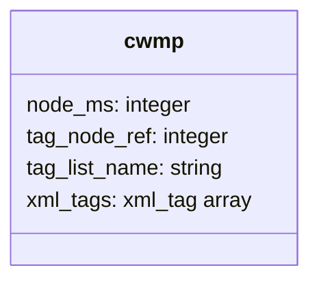
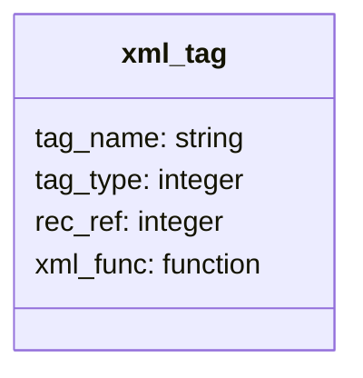
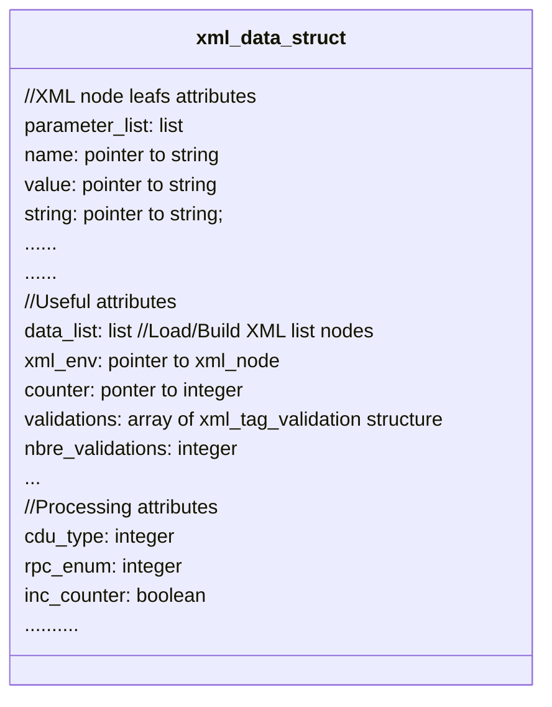
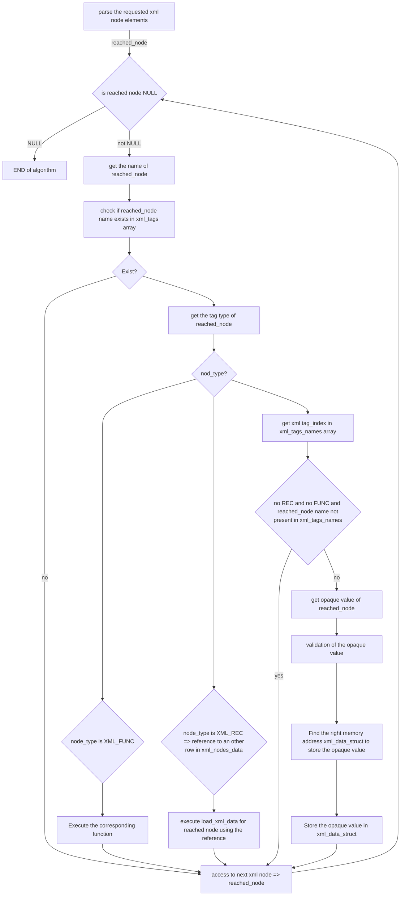
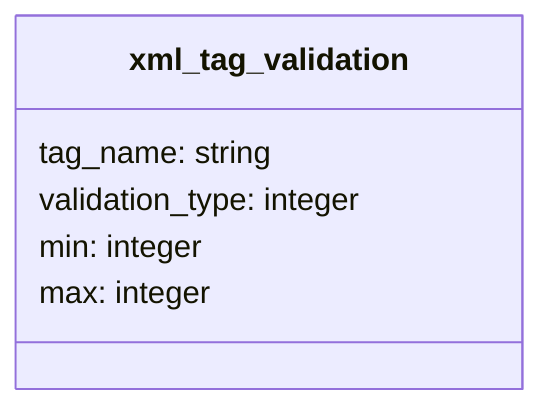
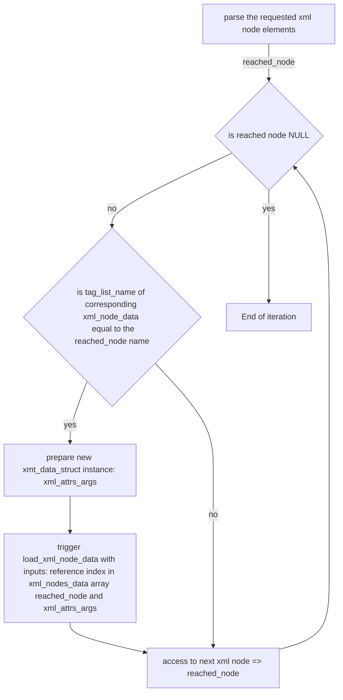
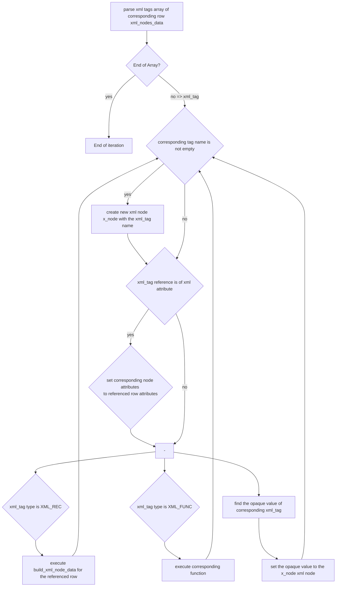
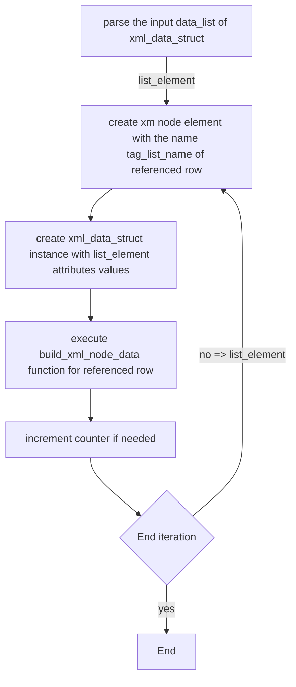

# XML mechanism in icwmp client

XML is an important component in icwmp. It's especially used to load and build SOAP messages and backup session nodes.

It's developed essentially with mxml library. It contains all needed structures and functions to load and build xml messages. 

All xml nodes names that are needed in icwmp for both SOAP and backup session are defined in an array **xml_nodes_data**.

The type of the array xml_nodes_data is __xml_node_data__ :

 

- node_ms: is an integer that can have two values (XML_SINGLE 0 or XML_LIST 1). Is used to indicate if the corresponding XML node is present as list or just one time.
- tag_node_ref: this integer attribute is an index in the same array xml_nodes_date of the corresponding node in case of list. Its value is 0 if the component is Single.
- tag_list_name: in case of list this string is the tag parent name of each node. Its value is NULL if the component is Single.
- xml_tags: is an array of tags under the node. xml_tag is the type of this array. Its structure is the following:

 

each xml node tag in XML mechanism developed in icwmp has as type the xml_tag structure that has presented attributes:

- tag_name: has as type string and it's the name of the tag
- tag_type: the type of the corresponding node and can be: 	XML_STRING, XML_BOOL, XML_INTEGER, XML_LINTEGER, XML_TIME, XML_FUNC, XML_REC, XML_ATTR
- rec_ref: is a reference to the XML node in the same array xml_nodes_data in case tag_type is XML_REC. Its value is 0 in case tag_type is different from XML_REC.
- xml_func: is a function that is a executed in case the corresponding node is reached and the tag_type is XML_FUNC. xml_func is NULL in case tag_type is different from XML_FUNC.

### xml_data_struct structure

The xml_data_struct is a structure used for both load and build xml messages. It contains two parts of attributes, the first part contains attributes used for xml leaf node values for both buld and load, the second part contains attributes used while executing load/build process:

 

- XML leafs attributes are used by load process to return leaf nodes values
- validations and nbre_validations attributes are used by the function **validate_xml_node_opaque_value** if the found value of a leaf XML node is valide.
- Processing attributes are used while executing load/build features

### XML Load mechanism

XML load mechanism in icwmp client is responsible to load values from an XML node. The main function that is responsible to do such feature is **load_xml_node_data**.

This function needs to know the XML node that we need to load values, and what XML tags we need to load value basing on a reference **node_ref** to a row in the array **xml_nodes_data**. 

The referenced row in the array **xml_nodes_data** can be Single or List depends on the tag_node_ref attribute value. 

Therefore xml_load_node_data function will check if the corresponding row row is a Single node or a List node, and then will execute one of the following functions:

- load_single_xml_node_data
- load_xml_list_node_data

Loaded results are returned in the corresponding attributes of the structure xml_data_struct. The corresponding attribute for each tag name in the XML is found using their index in the tags names array **xml_tags_names**.

#### load_single_xml_node_data function:

Single rows in the table define a node or a group of nodes  that appears just one time under the requested node. load_single_xml_nodes_data function is responsible to load values under such kind of nodes.

The process of loading a single row node is done by the following algorithm:

The load of a single by the parse of the input node tree. Basing on the type of reached_node the mechanism executes the need process.

While loading values from the XML node, the mechanism is checking the validations of those values. Validation is done using the function **validate_xml_node_opaque_value** and the **validations** array. Each XML load call has its validations attributes that are input to the load function in xml_data_struct.

Validations attribute is an array of the structure **xml_tag_validation** that has the following diagram:

 

-tag_name: a sting that has as value the XML node tag name.
- validation_type: integer that its value is used to choose the suitable validation function
- min: integer used to validate if value is in a range
- max: integer used to validate if value is in a range

For each XM node, **validate_xml_node_opaque_value** function is called. It find find suitable validation elemeent in **validations** array by the tag_name attribute, then it calls the right validation function basing on the validation_type attribute.

If the node is not validated it returns 9003 error.

The supported validation functions that are supported:

- icwmp_validate_string_length
- icwmp_validate_unsignedint
- icwmp_validate_boolean_value
- icwmp_validate_int_in_range

#### load_xml_list_node_data function:

List rows in the table **xml_nodes_data** define a node or a group of nodes  that appears multiple times in a sequence list under the requested node. load_xml_list_node_data function is responsible to load values under such kind of nodes.

The process of loading a list row node is done by the following algorithm:

The load of XML list is done by the parse of all xml elements in the corresponding node. For each node element that its name is the same as the tag list name in question, the function prepare a nex xml_data_struct instance that will be used to return nodes values under.

After that this instance is used to make a recursive call of **load_xml_node_data** function for the referenced row in the table **xml_nodes_data**

### XML build mechanism

XML build mechanism in icwmp client is responsible to build an XML node using input nodes values. The main function that is responsible to do such feature is **build_xml_node_data**.

This function needs to know the XML node that we need to build the node, and what XML tags and their values we need in the build basing on a reference **node_ref** to a row in the array **xml_nodes_data**. 

The referenced row in the array **xml_nodes_data** can be Single or List depends on the tag_node_ref attribute value. 

Therefore build_xml_node_data function will check if the corresponding row is a Single node or a List node, and then will execute one of the following functions:

- build_single_xml_node_data
- build_xml_list_node_data

Nodes attributes needed for the build are assigned to corresponding attributes in an instance in an xml_data_struct structure instance that is an input to the function build_xml_node_data. The corresponding attribute for each tag name in the XML is found using their index in the tags names array **xml_tags_names**.

#### build_single_xml_node_data function:

build_single_xml_node_data function is responsible to build XML nodes that contains nodes or group of nodes that appears just one time.

The algorithm of such feature is described in following diagram:

the build of a single node of xml_nodes_data array is done by the parse of the corresponding xml_tags array one by one. For each element the function creates the xml node and then set its opaque value basing on its type XML_REC, XML_FUNC, or otherwise.

#### build_xml_list_node_data

build_xml_list_node_data function is responsible to build XML nodes that contains nodes or group of nodes that appears multiple times in sequence list.

The algorithm of such feature is described in following diagram:

The algorithm is a parse of the data_list attribute of the structure xml_data_struct. For each element it creates an xml node with the name tag_list_name of the referenced row. Then it calls build_xml_node_data in order to build nodes under the created one.