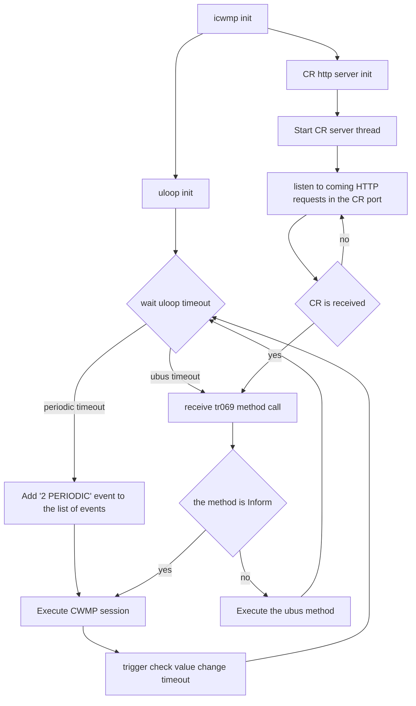

# Design of icwmp tr-069 client


## General Description
icwmp is client side implementation of CWMP protocol. Its source code is completely conform with TR-069 standard. So it supports all required features described in the TR-069 standard.
So TR-069 features like cwmp session, events management, soap management, RPC methods management ... are supportd in the icwmp implementation.

As descibed in TR-069 standard, CWMP stack comprises several components that are unique to this protocol, and makes use of several standard protocols. Those components are followings:

<table>
<tr><td>

|<div>CWMP Stack </div> and icwmp corresponding source files| 
|--|
|__Application__			  cwmp.c session.c|
|__RPC Methods__			  rpc.c||
|__SOAP__					  xml.c|
|__HTTP__					  http.c digauth.c|
|__SSL/TLS__				  ssl_utils.c|

</td><td>

|Common Source files|
|--|
|<div>backup_session.c </div><div> cwmp_uci.c </div><div> ubus_utils.c </div><div> subprocess.c </div><div> common.c </div><div> config.c </div><div> datamodel_interface.c </div><div> diagnostic.c </div><div> download.c </div><div> upload.c </div> notifications.c|

</td></tr> </table>

- Application: the application uses CWMP protocol on the CPE. In the icwmp client, the main application is defined in cwmp.c source file. It's based on uloop libubox functionality. Multiple timers are running under the main uloop of icwmp like session timer, ubus timer, heartbeat timer, ...
- RPC methods: The specific RPC methods that are defined by CWMP protocol. In icwmp client RPC methods are defined under the source file rpc.c.
- SOAP: A standard XML-based syntax used here to encode remote procedure calls. The SOAP part is developed in xml.c file and it's detailed in the section ...
- HTTP: this part is responsible to send SOAP messages over HTTP. In icwmp it's based on libcurl library. Its corresponding C functions are developed in the file http.c.
- SSL/TLS: The standard Internet transport layer security protocol. icwmp can work with openssl or mbedtls or wolfssl depending on the SSL library selection. Its corresponding functions are defined in ssl_utils.c file.

## Main structure of icwmp app
 
 The main structure in icwmp is the cwmp structure. Just one instance of cwmp structure is needed for the executing icwmp app. 
 
 The following schema presents this sctructure with the most important attributes:
 
 ```mermaid
classDiagram
class cwmp {
	conf: struct config
	deviceid: struct deviceid
	session: struct session
	heart_session: bool
	diag_session: bool
	event_id: int
	cr_socket_desc: int
	pid_file: FILE
}
```
 - conf: its type is the config structure. config structure is responsible to define the UCI configuration of the application and it's loaded in the start of icwmp. Multiple UCI options are defined in this structure such as configurations related to the CPE like CR credentials, CR port, provisioning code ... and configurations related to the ACS connection like ACS access username/password, periodic_inform_enable, periodic_inform_interval ...
 - heart_session: is a boolean attribute. This attribute is used to check if the running session is a Heartbeat session.
 - diag_session: is a boolean attribute. This  attribute is used to check if the running session contains the event '8 DIAGNOSTICS COMPLETE'
 - event_id: is an integer attribute, and is used by the app to store the number of events in the running session.
 - cr_socket_des: is an integer attribute. This attribute contains the id of the socket used by the CR.
 - pide_file: is a File type attribute. This file used by the app in order to garantuate a single app instance running.
 - deviceid: its type is deviceid structure. This struct contains the device information important attributes values: OUI, Manufacturer, SerialNumber, ProductClass, SoftwareVersion.
 - session: its type is session structure. This structure contains attributes related to the running application. 
 
  ```mermaid
classDiagram
class session {
	head_rpc_cpe: list
	head_rpc_acs: list
	events: list
	session_status: struct session_status
	tree_in: mxml_node_t
	tree_out: mxml_node_t
	body_in: mxml_node_t
	fault_code: int
}
```

 session attributes are:
 
 - head_rpc_cpe: its type is struct list_head. It contains RPC methods list that needs to be executed by the CPE in the actual session.
 - head_rpc_acs: its type is struct list_head. It contains RPC methods list that the CPE requests to be executed in the ACS side in the actual session.
 - events: its type is struct list_head. It contains list of events that the CPE notifies the ACS in the Inform message of the actual session.
 - session_status: its type is struct session_status. it contains informations about the running session like start time, end time, if it's successful or failed session, hearbeat session validation ...
 
## icwmp application
 
 The following diagram shows how icwmp application manage CWMP sessions with uloop:
 



 As described in the diagram, after initiating the icwmp application (config init, backup init, ...), the application trigger:
 
 1 - uloop initiation by initiating the following timeouts:
 
 - ubus methods timeout
 - autonomous policy timeouts
 - session timeout
 - heartbeat timeout
 - periodic session timeout
 
then the application start the uloop run by waiting uloop timeouts to come.

two kinds of timeouts can be detected:


2 - In the same time a thread is created. It permits a permenant listening of the port , in the purpose to receive connection requests.
In case a CR is received successfully "tr069 inform" ubus call is triggered from this thread in the purpose to trigger a new session with '6 CONNECTION REQUEST' event.


## icwmp tr-069 session

[CWMP session in icwmp client](./session.md)

## Inform ACS method

The Inform ACS request is sent by the CPE to the ACS in the start of the CWMP session, in order to inform him about some informations like the device id, events, software version, the CR url ...

In icwmp the corresponding function responsible to create the Inform message is cwmp_rpc_acs_prepare_message_inform. It starts by getting the device ID attributes and the list of events that needs to be included in the inform message and then parameters that are amended in the ParameterList including default Inform Parameter and other parameters like parameters related to the Value Change.


## Events manipulation

As described in TR069 standard, events in CWMP protocol must be sent by the CPE in an Inform request in order to notify the ACS when something of interest has happened. 

In icwmp when creating the inform message events are loaded from events list_head attribute of the session structure attribute.

As soon as the event is reached, it's added to the list events. Different scenarios are presents to reach event in icwmp:

- Start app events: this scenario includes following events: "0 BOOTSTRAP" (if it's the first Inform to be sent to the specified ACS), "1 BOOT"
- Get the event from the backupSession in the start of the App: Just after starting the icwmp app in the init step, the app loads the backupsession events in events list from "cwmp_event" xml tag. Then add the to the events list. This case includes events that occurs before the restart of the icwmp or reboot/upgrade of the system. In this scenario events included are: "M Reboot", "M Download", "M ScheduleDownload", "7 TRANSFER COMPLETE".
- Events when running CWMP session. Events for this scenario are detected and added to the events while executing the CWMP session especially in RPC calls. Such as "3 SHEDULED" for ScheduleInform method, "7 TRANSFER COMPLETE" (in the call of Download, Upload), "8 DIAGNOSTIC COMPLETE" (after completing diagnostic execution triggered by the ACS), "11 DU STATE CHANGE COMPLETE" after completing CDU request execution triggered by the ACS), "M Download", "M Upload" ...
- Events are detected at specific time using uloop_timeout_set:"2 PERIODIC", "14 HEARTBEAT"
- External Events: "6 CONNECTION REQUEST" when receiving a connection request from the ACS in order to start a new session. CR thread is permenantly listening on the CR port in order to detect such event and then trigger a new session. "4 VALUE CHANGE" (check notifications part), "10 AUTONOMOUS Single TRANSFER COMPLETE", "12 AUTONOMOUS  DU STATE CHANGE COMPLETE"

### Notifications

[Notifications in icwmp client](./notifications.md)

## XML in icwmp

__TODO__

xml structures: struct xml_node_data, struct xml_tag, struct xml_list_data, struct xml_data_struct, struct xml_tag_validation

struct xml_node_data xml_nodes_data[] array

xml load functions: load_xml_node_data, load_xml_list_node_data, load_single_xml_node_data

build_xml_node_data: build_xml_list_node_data, build_single_xml_node_data

## Backup Session management

**TODO**

Methods that needs backupsession

find node by id

insert functions

load functions

## UCI and config mangement

**TODO**


