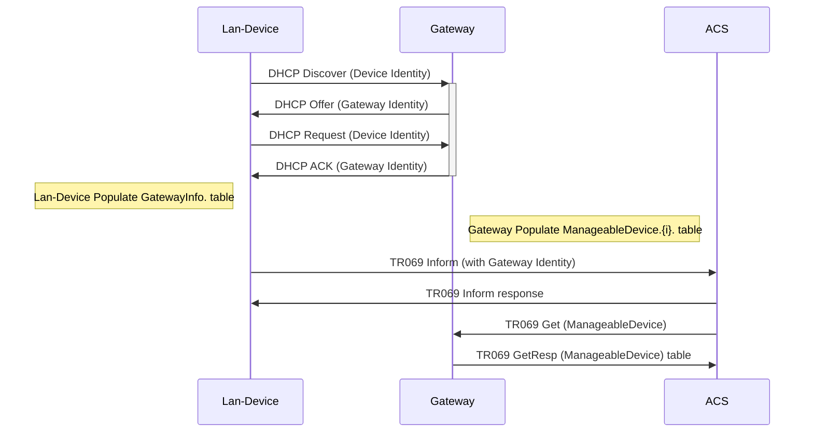

# Manageable devices and gateway information (TR069 - Annex F)

The CPE WAN Management Protocol can be used to remotely manage CPE Devices that are connected via a LAN through a Gateway. When an ACS manages both a Device and the Gateway through which the Device is connected, it can be useful for the ACS to be able to determine the identity of that particular Gateway.
> -- <cite> TR-69 Annex F.</cite>

Below is the sequence diagram for the Device-Gateway association with DHCP Discover.



## Gateway Procedures
A Gateway here in this context means, an Annex-F capable CPE running icwmpd which provide LAN/NAT connectivity.

The Gateway Identity tuple (OUI, ProductClass, SerialNumber) is present in 'db' (Same source used for Device.DeviceInfo. object).

The `/etc/init.d/icwmp` script reads the default lan interface from UCI option `cwmp.cpe.default_lan_interface` and configures the gateway identity in `dhcp` UCI for the corresponding LAN interface section to publish gateway information to its LAN clients.

!!! note
    
    If UCI option `cwmp.cpe.default_lan_interface` is not defined then gateway identity would not be published in LAN network.

### Identification of Manageable Device in LAN network
Gateway device relies on DHCP options (/tmp/dhcp.client.options) file for getting the Manageable Device identities, which is exposed in the TR181 datamodel using (libbbf) API's.

The Device.ManagementServer.ManageableDevice.{i}. object table is populated for the active devices available in `Device.Hosts.` table and their device identity is collected from `/tmp/dhcp.client.options` file.

## Lan-Device procedures
A Lan-Device here in this context means, an Annex-F capable CPE running icwmpd which is connected via a LAN through a Gateway.

The Lan-Device Identity tuple (OUI, ProductClass, SerialNumber) is present in 'db' (Same source used for Device.DeviceInfo. object).

The `/etc/init.d/icwmp` script reads the default wan interface from UCI option `cwmp.cpe.default_wan_interface` and configures the device identity in `network` UCI to publish its own identity to upstream network (DHCP server) using DHCP option 125 for the corresponding wan interface.

!!! note
    
    If UCI option `cwmp.cpe.default_wan_interface` is not defined then it assumes the default interface as `wan`.

### Identification of Gateway Device in WAN network
If lan-device(CPE) receives DHCP option 125 in DHCP offer from upstream network it exposes the same in its UBUS method (e.g. ifstatus wan).

```bash
root@iopsys-44d43771b000:~# ifstatus wan
{
	...
	...
	"data": {
		"opt125": "XXXXXXXXXXXXXXXXXXX"
	}
}
```

ICWMPD package adds a [DHCP client hook script](https://dev.iopsys.eu/iopsys/icwmp/-/blob/devel/files/etc/udhcpc.user.d/udhcpc_icwmp_opt125.user), which parses DHCP option 125 to extract gateway identity based on Enterprise ID `3561`.
This script then writes the gateway identity in `/var/state/cwmp` if CWMP is enabled in the device.

Datamodel (libbbf) API's reads the gateway information from `/var/state/cwmp` to populate Device.GatewayInfo. object. If gateway information is not available in `/var/state/cwmp` then it reads the 'db' (Same source used for Device.DeviceInfo. object) and maps that data to populate Device.GatewayInfo. object.
