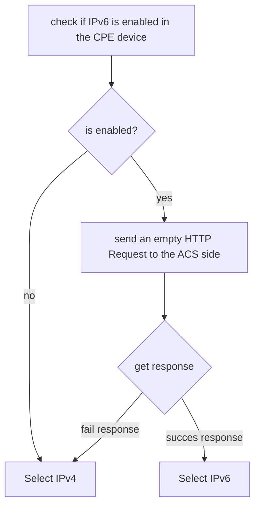

# Dual Stack IP in icwmp:

IPv4/IPv6 switch is done automatically in icwmp client. The CPE checks what's the suitable IP protocol (IPv4 or IPv6) to communicate with the ACS respecting those conditions:

- IPv6 has the priority in the connection
- if IPv6 is disabled in the CPE side, so the CPE will automatically switch to IPv4 as IP protocol for the communication with the ACS side.
- If the CPE is not able to communicate with the ACS using IPv6, so it switches automatically to IPv4 as an IP protocol.

This check is done in the beginng of the CWMP session respecting the following algorithm:

While the CPE must prioritize the IPv6, so it starts by checking if IPv6 is working in the CPE, then sends a HTTP message to the ACS side through IPv6 before making the same test in IPv4.

### Dual Stack configuration

Two uci options are present to configure dual stack:

- cwmp.cpe.default_wan_interface: that is the network interface that is used to check the connection with IPv4.
- cwmp.cpe.default_wan6_interface: that is the network interface that is used to check the connection with IPv6.